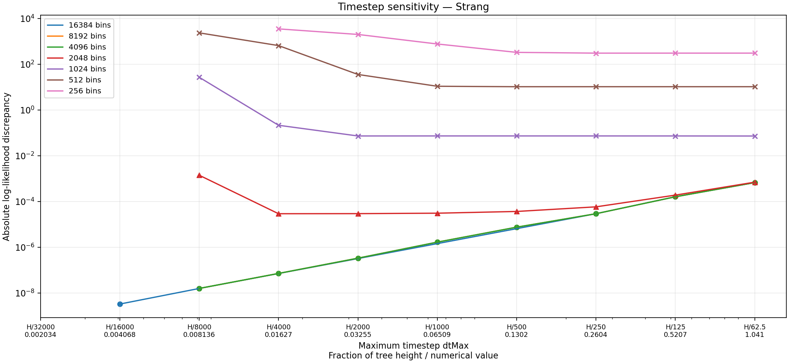
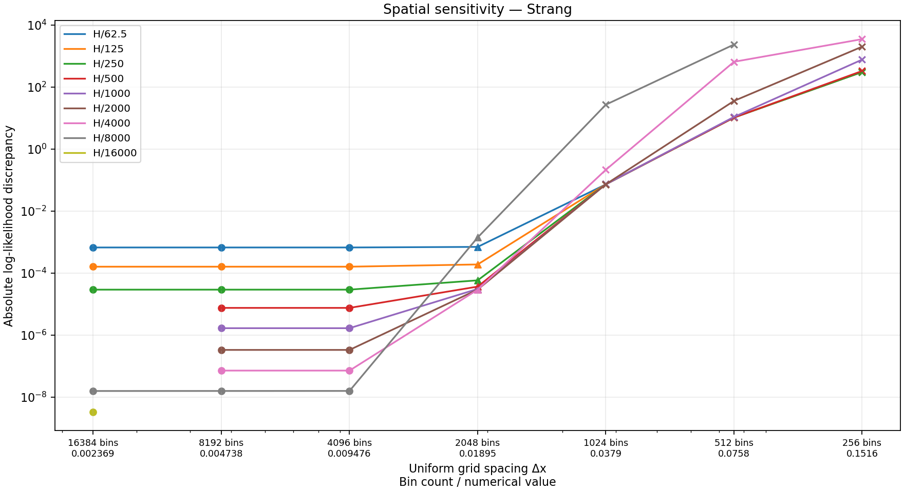
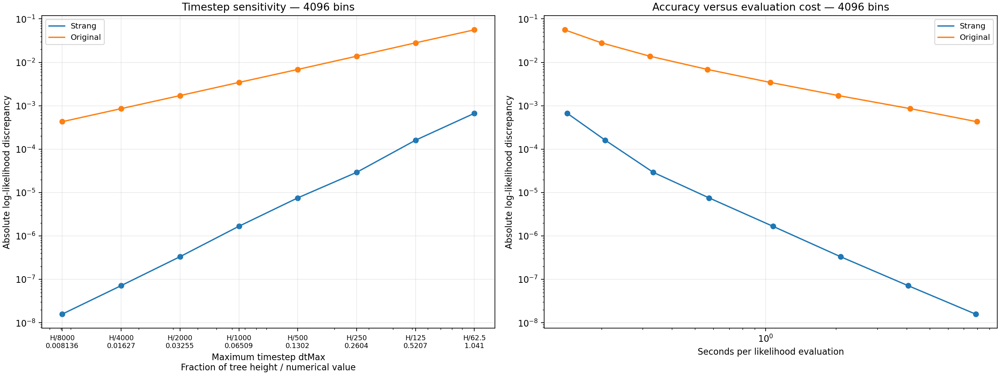

# QuaSSE likelihood accuracy: space, time, and splitting

This study asks how much the **log likelihood** changes when we refine the spatial grid or shorten
the integration timestep. It evaluates one fixed 233-species primate example, not an MCMC chain.
All measurements use the same padding rule.

## Main findings

- **At 4096 bins and above, shortening Δt improves accuracy substantially.** Further spatial
  refinement changes the result very little at a matched timestep.
- **Coarse grids cannot be repaired just by shortening Δt.** At 1024 bins the discrepancy stays
  near 0.073 over much of the range, then grows to about 27 at H/8000.
- **Strang splitting is much more accurate for similar work per timestep.** At 4096 bins,
  Strang at H/125 gives a discrepancy of 0.000161 in 0.21 seconds; the original method at
  H/8000 gives 0.000430 in 7.95 seconds.

Selected absolute log-likelihood discrepancies:

| Uniform bins | H/62.5 | H/250 | H/8000 |
| ---: | ---: | ---: | ---: |
| 256 | 304.640 | 304.194 | nonfinite |
| 512 | 10.3702 | 10.3697 | 2343.45 |
| 1024 | 0.0725976 | 0.0732384 | 26.9014 |
| 2048 | 0.000699255 | 0.0000583662 | 0.00140772 |
| 4096 | 0.000670133 | 0.0000292449 | 0.0000000158716 |
| 8192 | 0.000670133 | 0.0000292449 | 0.0000000158310 |
| 16384 | 0.000670133 | 0.0000292449 | 0.0000000157951 |

The reference is **log L = −829.9955135161624**, computed with 16384 bins and H/32000.
Its remaining temporal error is estimated at roughly 10⁻⁹ under second-order convergence;
this is not a certified bound on total PDE error. The reference checks are detailed below.

## Reading the figures

“Error” below means absolute difference from our finest numerical reference, not a certified
bound on error relative to the exact PDE solution. Axes are logarithmic; lines connect measured
points and do not imply that intermediate settings were evaluated.

Every spatial and timestep tick has two lines: **the generating setting above, its numerical value
below**. Thus “H/250 / 0.2604” describes one coordinate, not two different choices. H is the tree
height, 65.0916859837, and dtMax = H / divisor. A branch of length L uses Δt = L / ceil(L / dtMax),
so actual steps can be smaller than the limit, especially on short branches.

Likewise, “8192 bins / 0.004738” means Δx ≈ 0.004738 on the fixed-width grid. Bin counts include
padding, not just the usable trait points. The full Fourier width is n × Δx = 38.8119496472;
padding takes space out of that interval. Usable endpoints are recorded in the measurement table.

| Timestep setting | Numerical dtMax |
| --- | ---: |
| H/62.5 | 1.041467 |
| H/125 | 0.52073349 |
| H/250 | 0.26036674 |
| H/500 | 0.13018337 |
| H/1000 | 0.065091686 |
| H/2000 | 0.032545843 |
| H/4000 | 0.016272921 |
| H/8000 | 0.008136461 |
| H/16000 | 0.004068230 |
| H/32000 | 0.002034115 |

| Uniform bins | Numerical Δx |
| ---: | ---: |
| 256 | 0.151609178 |
| 512 | 0.075804589 |
| 1024 | 0.037902295 |
| 2048 | 0.018951147 |
| 4096 | 0.009475574 |
| 8192 | 0.004737787 |
| 16384 | 0.002368893 |

Markers describe the worst kernel variance retention encountered during evaluation:
**○** at least 99.9%; **△** at least 95% but below 99.9%; **×** below 95%.
These thresholds measure resolution of the sampled Gaussian kernel, not likelihood accuracy.
The reference has zero discrepancy from itself and is omitted from logarithmic error plots.

## What timestep refinement changes



At 4096 bins and above, the curves nearly coincide: the principal remaining error is temporal,
not spatial, over these measured settings. Strang splitting gives much faster convergence than
the original splitting method, although successive error ratios need not be exactly four.
The number and size of integration steps depend on individual branch lengths, not just dtMax.

At 1024 bins, much of the curve is a spatial-error plateau. Shortening the timestep initially
does little to help. At the smallest timesteps, it makes the result markedly worse: the sampled
diffusion kernel becomes too narrow relative to Δx to express its intended variance.
The 2048-bin curve has a smaller plateau and also deteriorates at H/8000.

At 256 bins, discrepancies are about 304 at the largest timesteps, rising to 3491 at H/4000.
H/8000 produces a nonfinite likelihood and is recorded as a failure, not plotted as an error
value. All eight settings have severely unresolved kernels: minimum variance retention is about
4.2 × 10⁻²⁸, falling to 8.6 × 10⁻³⁷ at H/8000. Finite output here does not imply useful accuracy.

A slightly lower absolute discrepancy at a larger timestep need not mean a more accurate
time-integration method: errors from spatial and temporal approximations can cancel.
Simply decreasing Δt without refining Δx is therefore not a reliable convergence test here.

## What spatial refinement changes



At fixed dtMax, refining the grid removes the coarse-grid error until the curve reaches a
temporal-error plateau. This is why further spatial refinement has almost no visible benefit
at the larger timesteps once 4096 bins are reached. Both Δx and Δt matter.

Only measured points are shown. The 16384-bin series is deliberately sparse: H/62.5, H/125,
H/250, H/8000, H/16000 and H/32000. The H/16000 spatial curve has just one point; H/32000
contains only the reference and consequently has no positive discrepancy to plot.

## Strang versus the original method



Both methods use 4096 bins and exactly the same spatial geometry in this comparison.
“Original” uses the archived, source-checked native implementation from before Strang splitting;
it is not a comparison with a different FFT implementation.

The original method's discrepancy decreases approximately twofold with each halving of Δt,
with observed ratios 1.99–2.03, consistent with first-order global temporal error.
Strang's finer-step behavior is consistent
with second-order convergence. At a given timestep the costs are similar, but Strang is much
more accurate; conversely it can take larger timesteps for a chosen discrepancy.
These are measured tendencies for this parameter setting, not universal error guarantees.

Timing starts after Java initialization and FFT preparation, but includes the study's kernel
diagnostics. Each point is a single evaluation rather than a warmed MCMC benchmark.
Full subprocess time is also available in the table.

## How reliable is the numerical reference?

All three reference refinements use the same 16384-bin grid and padding:

| Timestep limit | Log likelihood | Change from preceding row | Evaluation seconds |
| --- | ---: | ---: | ---: |
| H/8000 | −829.9955135319575 | — | 37.33 |
| H/16000 | −829.9955135194579 | +1.24996 × 10⁻⁸ | 73.57 |
| H/32000 | −829.9955135161624 | +3.29544 × 10⁻⁹ | 148.06 |

Successive changes shrink by a factor of 3.79, corresponding to observed order 1.92.
If second-order convergence continues, the remaining H/32000 temporal error is approximately
3.29544 × 10⁻⁹ / 3 = 1.10 × 10⁻⁹. This inference concerns temporal error only.

At H/8000, refining from 4096 to 16384 bins changes the log likelihood by 7.65 × 10⁻¹¹.
This supports spatial stability at that timestep, but does not independently measure the spatial
error at H/32000. The usable reference interval is approximately [−10.2266, 25.7521].

Two checks at H/8000 changed log likelihood by much less than 10⁻⁹:

| Check | Comparison with matched main run | Absolute change |
| --- | --- | ---: |
| Double Fourier width, 16384 bins | 8192 bins, same Δx, ordinary width | 2.81 × 10⁻¹¹ |
| Increase Gaussian support from 8 to 10 SDs | 8192 bins, same Δx and width | 1.50 × 10⁻¹¹ |

The first preserves Δx while widening the domain; the second changes kernel support and usable
endpoints. Together with the refinements above, they support using this result as a numerical
reference at approximately the 10⁻⁶ scale. They do not prove total accuracy at the 10⁻⁹ level:
we have not repeated spatial/domain checks at H/32000, and all calculations share the same PDE
implementation.

## Model and experiment

The input is [the 233-species example](../../examples/QuaSSE_233_primates_MCMC.xml):
a fixed primate tree and natural-log body-mass observations. Parameter values are λ₀ = 0.15,
λ₁ = 0.25, midpoint = 7.75, steepness = 1, μ = 0.1, diffusion variance rate q = 0.03,
drift = 0, and observation SD = 0.02. Speciation varies sigmoidally with the trait.
Extinction, drift and diffusion coefficients are constant in both trait space and integration
time. The root prior is Observed, with survival conditioning. Priors on model parameters do not
contribute to the reported log likelihood.

Every evaluation uses a uniform grid, with no fine-to-coarse switch. The midpoint and full Fourier
width are fixed across the main measurements. Padding is always sized for H/62.5 and eight Gaussian
standard deviations, even when the integration timestep is much smaller. Thus geometry does not
change with dtMax within a given bin count.

There are 62 main evaluations:

- Strang: 256, 512, 1024, 2048, 4096 and 8192 bins, each at H/62.5 through H/8000 by successive halving.
- Strang: six settings at 16384 bins, listed above.
- Original: 4096 bins at H/62.5 through H/8000.

Two additional boundary checks use doubled Fourier width or ten-standard-deviation support.
They are recorded in the same table but excluded from the main curves.
The original 56 evaluations completed successfully in 435.30 seconds including startup.
Eight additional 256-bin evaluations took 4.67 seconds including startup (0.65 seconds of likelihood
computation); seven returned finite likelihoods and one returned a nonfinite likelihood.
All 64 traversed 464 branch-segment kernel requests. Earlier measurements and the reference
are unchanged.

At 256–2048 bins, diagnostic mode permits positive variance loss so that we can measure its
consequences instead of discarding those likelihoods. Zero variance, invalid normalization and
nonfinite kernels remain errors. Finer grids use the 99.9% guard. A completed diagnostic run
does not imply an adequately resolved kernel. Counts refer to branch-segment kernel requests,
including cache hits, rather than every integration step.

The results do not test nonzero drift, other parameter values, MCMC proposals, or the
fine-to-coarse transition. In particular, an accuracy choice here is not a safe default for an
entire posterior distribution.

## Files and commands

[measurements.tsv](measurements.tsv) is the only data table. Its first line is a JSON comment with
the initial input/code hashes and run revision; the remaining lines are tab-separated measurements.
The runner was subsequently extended to add 256 bins; input, Java driver and numerical binaries
still match these hashes.
Columns record settings, method, guard mode, log likelihood, computation time, actual timestep
range, kernel variance diagnostics and usable grid geometry. Rows marked `kind=boundary` are
the separate boundary checks. Figure discrepancies are computed directly from these likelihoods.

From the SSE repository root:

```sh
python3 validation/likelihood_reference2/run.py --plot-only
# To compute missing settings, with BEAST2_HOME set and compiled Java/native code available:
python3 validation/likelihood_reference2/run.py
```

Plotting requires Python and Matplotlib only. Measurement additionally requires Java, BEAST2,
the release native library at `build/gcc-16/libsse_quasse.so`, and the verified archived library
at `build/strang/baseline/libsse_quasse.so`. The latter is a local archive, not rebuilt by this runner.
The runner compiles the experimental Java driver and keeps classes, input copies and execution
logs under `build/likelihood-reference2/`. It runs serially with a 900-second budget, appends each
completed result immediately, and skips settings already in the table on resume. Runner changes
to extend the matrix or adjust plots are allowed; changed input, Java driver or numerical binaries
require preserving the old table before starting a fresh run.

The previous `likelihood_reference/` archive is untouched and is not needed to generate these figures.
