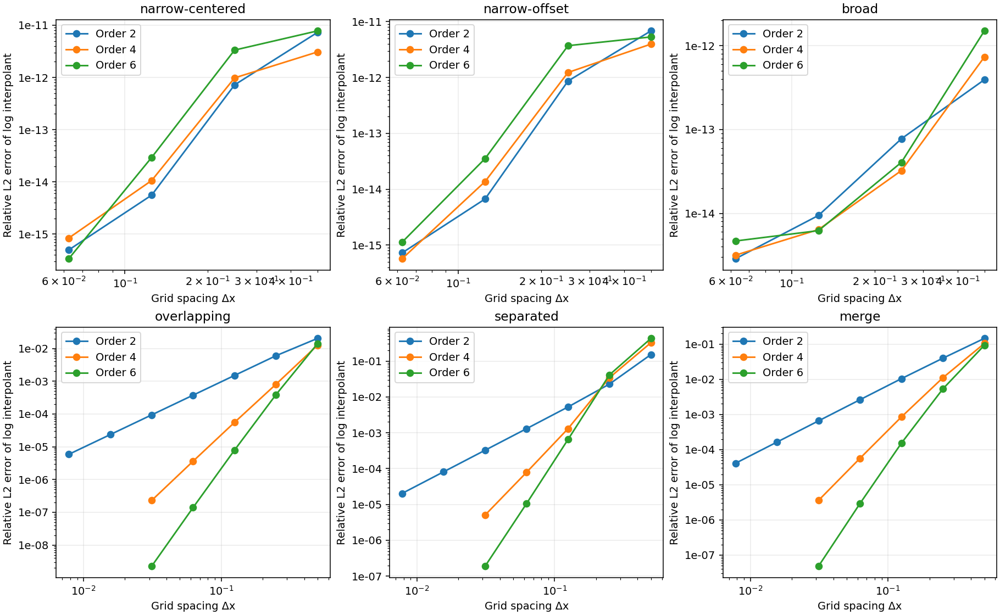
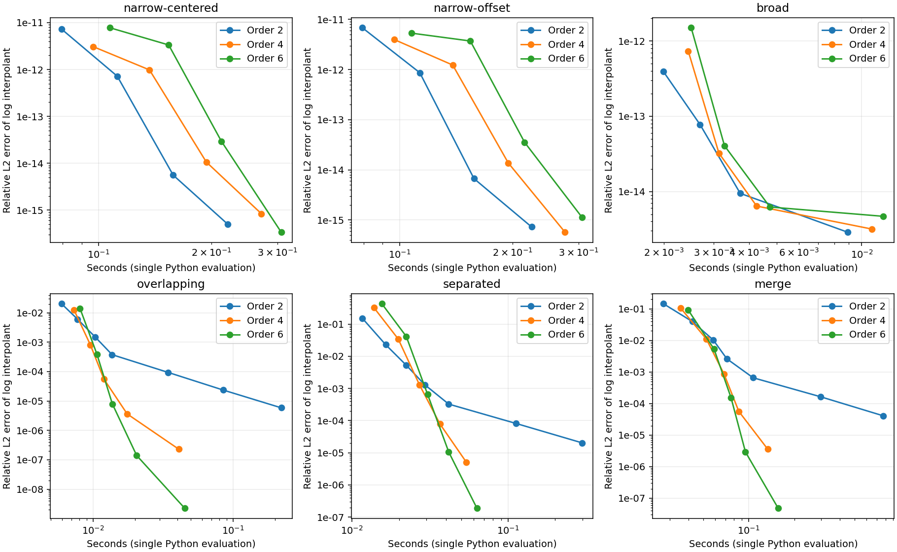
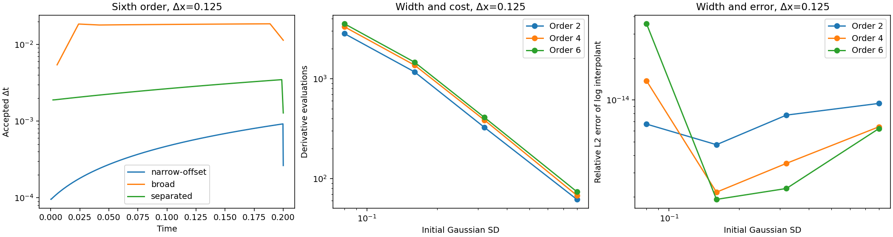

# Experimental high-order transport of log likelihoods

2026-10-05. Separate development bookmark: `log-pde-experiment`.

This is a standalone numerical experiment, not a production QuaSSE integrator. It tests
whether high-order finite differences on **h = log D** can reduce spatial resolution and
computational work. Production sources and defaults are unchanged.

**Result:** high spatial order survives non-Gaussian shapes and a node merge in these tests.
It substantially reduces the grid size needed for some accuracy targets. Explicit time
integration is still expensive for narrow initial Gaussians and large trait domains.
Practical boundaries, E propagation, reactions and full-tree likelihoods remain untested.

## Findings

All **183 runs completed**, including the tighter time-tolerance and domain checks.
They took about 11.5 seconds of summed propagation time on this machine in the saved run;
setup, error calculations and plotting are outside that measurement.

### Spatial order is realized beyond Gaussians

Observed grid-point L2 orders on refinement from Δx = 0.125 to 0.0625:

| Problem | Second-order formula | Fourth-order formula | Sixth-order formula |
|---|---:|---:|---:|
| Overlapping mixture | 2.01 | 3.94 | 5.83 |
| Separated mixture | 2.00 | 3.99 | 5.70 |
| Mixture node merge, then propagation | 1.99 | 3.91 | 5.71 |

Single Gaussians are special: their logs are quadratic, so all three derivative formulas
are spatially exact in exact arithmetic with the supplied exterior values. Their small
errors here measure time integration and rounding, not a spatial convergence order.



The figures use **off-grid reconstruction error**, integrating the squared discrepancy
between the exponentiated log interpolant and the analytic reference. The table above uses
stored grid values to isolate the propagation error. Both metrics are saved.
All curves in these two figures use atol = 10⁻⁹, rtol = 10⁻¹² and domain [−4,4].

Higher order is not automatically better on a coarse grid. For the separated mixture at
Δx = 0.5, sixth-order grid-point relative L2 error is about 0.214, versus 0.0391 for second
order. Sixth-order reconstruction error there is still larger, about 0.429. Refinement is
needed before the high-order approximation delivers its advantage.

### Benefits at matched accuracy

For the overlapping mixture with a relative reconstructed-L2 target of 10⁻⁵:

| Order | Δx | Stored points | Measured error | Derivative evaluations | Seconds |
|---|---:|---:|---:|---:|---:|
| 2 | 0.0078125 | 1025 | 5.86 × 10⁻⁶ | 3350 | 0.221 |
| 4 | 0.0625 | 129 | 3.63 × 10⁻⁶ | 278 | 0.018 |
| 6 | 0.125 | 65 | 7.95 × 10⁻⁶ | 212 | 0.014 |

These are the fastest qualifying settings among the measured grids at the stated tolerance,
not optimized parameters or precise speedup estimates. Each timing is a single Python solve,
including evaluations of analytic exterior data. The derivative-evaluation and grid-size
differences are more reproducible evidence than small timing differences.

The node-merge example also benefits: at target 10⁻⁴, second order used 1025 points and
11892 evaluations across the three branches; fourth order used 129 points and 1386
evaluations. Fourth order was faster than sixth order at that target. At target 10⁻⁵,
sixth order reached the target on 129 points, while fourth order used 257.



There is no native SSE timing comparison and no ordinary-scale finite-difference control.
Thus this establishes a benefit of increasing order **within this log solver**, not that
the log solver outperforms existing Gaussian convolution or that logging alone caused the gain.

### Narrow tips still cost time

At Δx = 0.125 with sixth-order derivatives and atol = 10⁻⁹:

| Initial Gaussian SD | Derivative evaluations |
|---:|---:|
| 0.08 | 3548 |
| 0.16 | 1466 |
| 0.32 | 410 |
| 0.80 | 74 |

These cases all have mean 0.137, drift 0.3 and diffusion variance rate 0.2. The narrowest
Gaussian is spatially easy in log form but much more expensive to integrate in time.
Accepted timesteps grow as it broadens. A small final step often just lands on the endpoint.



Increasing domain extent from 2 to 8 at the same spacing raises the narrow-Gaussian
evaluation count from 2018 to 5804. The separated mixture similarly rises from 194 to
1238, while its grid-point L2 error remains about 0.000549. Exact exterior data are used
in all these comparisons; this does not test approximate boundary conditions.

The log equation linearized about h contains (v + q hₓ) times the perturbation gradient.
Large tail slopes can restrict explicit integration. The measurements establish cost
sensitivity to width and extent; they do not separate stability restrictions from the
cost of satisfying the error controller throughout the tails.

### Temporal and quadrature checks

The main sweep uses absolute log tolerances 10⁻⁶ and 10⁻⁹; selected sixth-order runs also
use 10⁻¹¹. Relative tolerance remains 10⁻¹², so the component error scale is
atol + rtol × |shifted h|, rather than a pure absolute tolerance in far tails.

For example, at Δx = 0.125 the separated mixture's sixth-order grid-point error remains
about 0.000549 across those tolerances; the merge error remains about 0.000153. Tightening
time integration does not remove those spatial errors. Durations 0.02, 0.2 and 1.0 are also
compared for the narrow offset Gaussian and separated mixture. See [results.md](results.md).

Integrals use a degree 3, 5 or 7 interpolant of h for derivative orders 2, 4 or 6, followed
by Gauss-Legendre integration on each grid interval. This interpolation is postprocessing;
the solver still stores only one value per point. Comparing 16 and 32 quadrature nodes per
interval changes the integral by less than 10⁻¹⁴ relatively in the saved cases. That checks
quadrature of the interpolant, not its agreement with the true function. Integral error
against the analytic finite-domain Gaussian-mixture integral is reported separately.

## Mathematical and implementation details

The equation is

```text
h_t = v h_x + (q/2) (h_xx + h_x²),   h = log D.
```

Each Gaussian component stores log integrated weight, mean and variance. Under the backward
transport convention, its mean becomes m − vt and variance becomes s² + qt. A log-sum-exp
of the component densities gives the analytic log reference without underflow.

`solver.py` computes centered first and second derivatives of orders 2, 4 or 6 and uses
SciPy RK45 with adaptive timesteps. Each solve subtracts one fixed initial log offset and
restores it on output. The offset has zero space and time derivatives; there is no hidden
normalization or continuously changing scale. Neither h nor D is clipped or floored.

All stored points, including the interval endpoints, are evolved. The required exterior
points beyond both endpoints are supplied from the analytic solution at every RK stage.
That isolates the interior approximation but provides information unavailable in a general
likelihood calculation. RK stages are capped at 20000 derivative evaluations per branch;
failures are recorded and omitted from error curves, not assigned a finite error.

In the merge case, two mixtures evolve on separate branches. Their **numerical** logs are
added along with log(0.15), and that result is propagated along a parent branch. The analytic
reference is the full pairwise Gaussian product, including overlap amplitudes. No components
are discarded, and child numerical errors are retained in the parent's initial state.
All three branches have the stated duration. The factor 0.15 is only a node factor here:
birth/death reaction evolution is deliberately absent.

The main grid has domain [−4,4], spacings 0.5, 0.25, 0.125 and 0.0625, and duration 0.2.
Finer second-order grids down to 0.0078125 and fourth/sixth-order grids at 0.03125 allow
matched-error comparisons. Domain, width and duration checks change one of those settings.
Case definitions and every setting are in `run.py` and the measurement table.

Saved metrics distinguish:

- Grid-point relative L1/L2 errors, using trapezoidal weights on the finite interval.
- Maximum log error at all points, and at points with reference D at least 10⁻⁸ times
  the maximum sampled reference D; also mean signed log error on that latter set.
- Relative L2 error of the exponentiated log interpolant, using 32-point quadrature.
- Relative integral error against the analytic finite-domain integral, and quadrature
  changes on increasing the per-interval node count from 8 to 16 to 32.
- Propagation seconds, derivative evaluations and accepted steps. Timesteps themselves
  are saved for each branch, with time measured from that branch's start.

## Reproduction and files

From the SSE repository root, using Python with NumPy, SciPy and Matplotlib:

```sh
MPLCONFIGDIR=/tmp/sse-matplotlib OPENBLAS_NUM_THREADS=1 \
    python3 -B validation/log_pde/run.py

# Regenerate figures and numerical tables without solving again:
MPLCONFIGDIR=/tmp/sse-matplotlib \
    python3 -B validation/log_pde/run.py --plot-only

# Regenerate this HTML report after editing this Markdown file:
pandoc --standalone validation/log_pde/README.md -o validation/log_pde/README.html
```

The full command replaces this experiment's measurements and outputs. It requires no Java,
BEAST, native SSE library, or network access. It starts with small polynomial-derivative and
Gaussian-product checks. [metadata.json](metadata.json) records dependency versions and
source hashes; [measurements.csv](measurements.csv) contains all final metrics and statuses.
[steps.csv.gz](steps.csv.gz) is the compressed accepted-timestep table.
[results.md](results.md) is regenerated from measurements; this README is the interpretation.

## What this suggests next

The measured spatial improvement justifies further investigation. A useful next comparison
would assess explicit versus implicit stepping on these same cases, and develop practical
boundary conditions. Those decisions should precede local spatial adaptivity or full SSE
integration. Uniform-grid refinement checks already provide a basis for investigating an
adaptive spatial error estimate; this experiment does not implement grid selection.

No production claim follows yet: the experiment omits E, branch reactions, variable rates,
fossil events, real root priors, resolution transfers, arbitrary observation models and exact
zeros. It also does not test an MCMC chain or establish a full-likelihood error tolerance.
